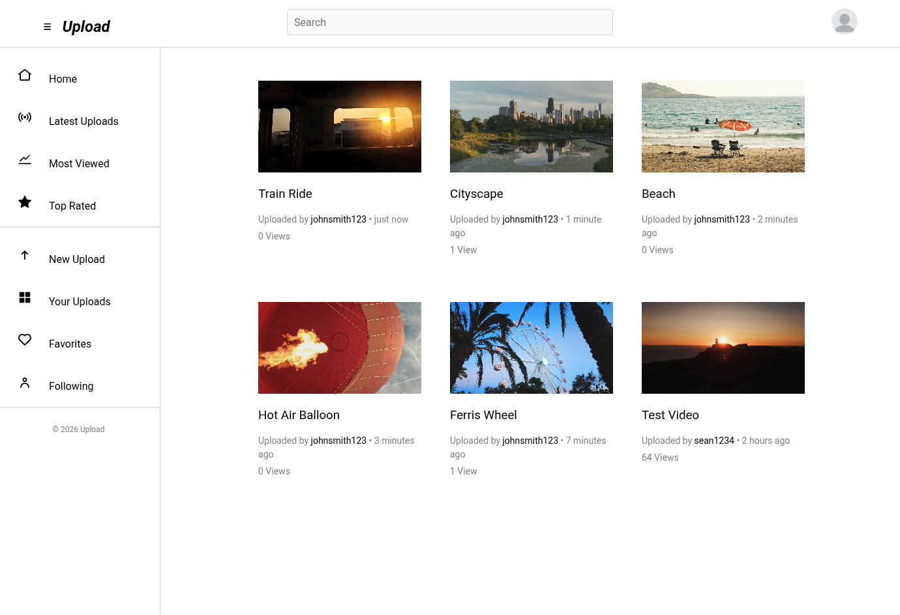

# Upload

Upload is a video and image sharing site.

## Setup

Clone the repository, run `composer install`, set up database using `upload.sql` and set credentials in `config.php`. Run the app using PHP's development server: `php -S localhost:8000 -t public`